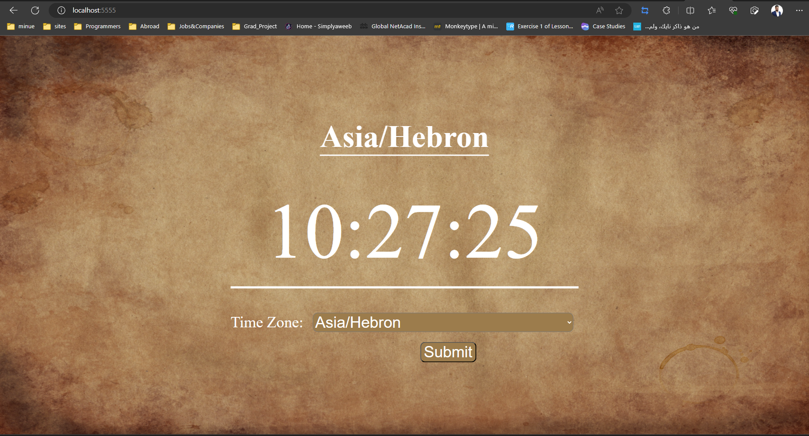

# ITG-Training

## Task2-Part2-NPM Packages

### Task Description  
- Create an app that takes a specific time zone (such as Asia/Hebron) and provides the current time based on the time zone specified.
- The app should have an entry point and another file(s) to contain the modules.
- The modules type should be ECMAScript.

## Aproach

### Tools used in this task  
- NodeJS + Express for the back-end.
- HTML + CSS for the front-end.

### Initialize Project  
- Used the following to initialize node project:
  ```
  npm init
  ```
-  Configure Node to run ES6JS using Babel:
  ```
  npm i @babel/cli @babel/core @babel/node @babel/preset-env
  ```
- Create a new file named ".babelrc"
- Added this configuration in it:  
  ```
  {
    "presets": [
        "@babel/env"
    ]
  } 
  ```
- To run ES6JS:  
  ```nodemon --exec babel-node src/index.js```
- Structure my project as follows:
  - Middleware: added validation file.  
    I used joi package for that ```npm i joi```
  - public: added CSS and Images folders/files
  - Routes: Which contain just the homepage.
    I handled HTML file using ejs ```npm i ejs```
  - Views: addrd HTML file.
- Created simple page to display clock.  
Also, contains selectbox to let the user select the wanted timeZone.
- To get the time zones and display the time I used moment-timezone Package. ```npm i moment-timezone```
  It has the following methods:  
  ```js
  import moment from "moment-timezone";

  console.log(moment.tz("Asia/Jerusalem"));//this will display the time zone according to Jerusalem time.
  console.log(moment.tz("Asia/Jerusalem").format("hh:mm:ss"));//this will display the time in format hh:mm:ss.
  console.log(moment.names());//this will return a list with all time zones in the world.
  ```

## Page Image:


## Pagination:
A simple defenition of pagination is displaying a subset of results to improve the page performance.  
Lets take google search as example. When we want to search for something. It doesn't return all the searching resul in a single page. It returns a subset of results and make an indicator in the bottom 1 2 3 ... n, to indicate in which page we are. If we want to see the other results we send the page number and it will return the results that are in the same page.

PageNumber: wanted page number.
Limit: Number of results appeared in a single page.

Start Index = (PageNumber - 1) * Limit 
End Index = PageNumber * limit

Now, the best Practice for applying pagination is applying it in page that dispalys books, movies or search.

There is different style of pagination:
- The regular pagination.
- Load more
- Infinite scroll

For validating time zone. I used `npm i joi-tz` I extended  joi-tz to the original package joi.