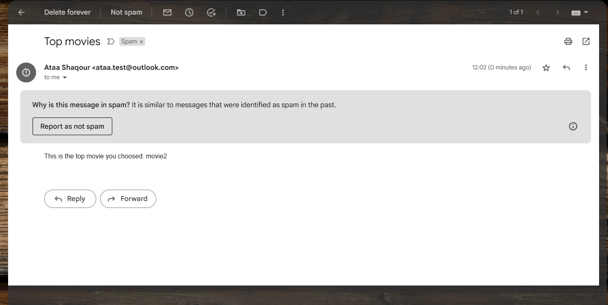
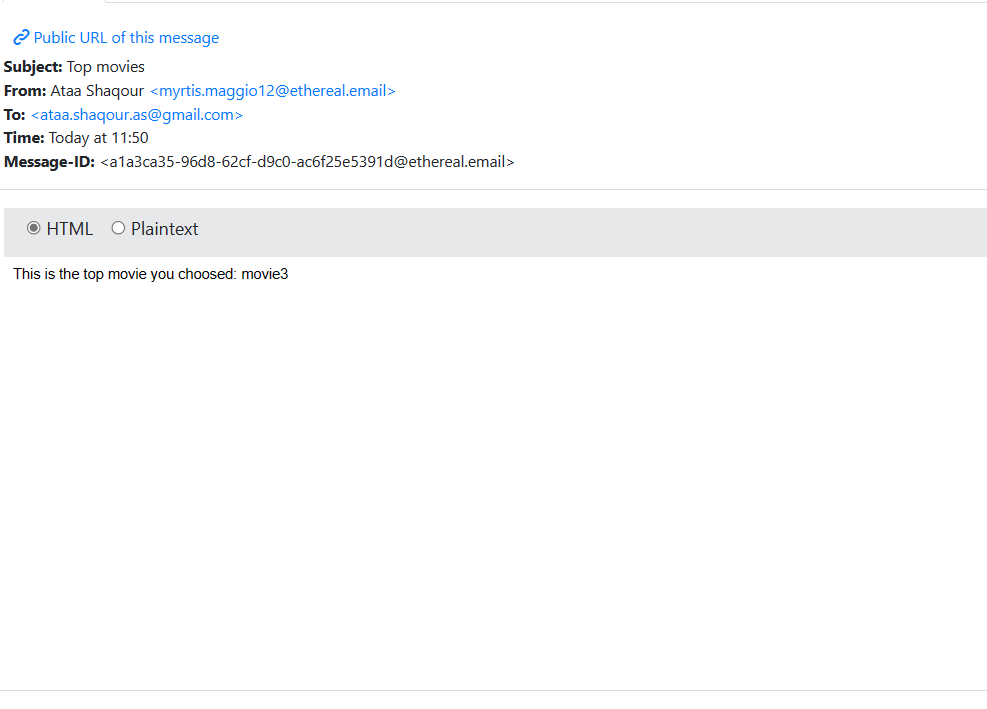

# ITG-Training
## Branch Description:
This branch aims to solve the following task.
## Task: AsyncJS
- This task aims to know the difference between a callback and async-await approaches.
- Also, how to integrate an actual email service.
## Tools and packages:
- For the back-end: NodeJS, ExpressJS.
  - For initializing the project:  
    ```npm init```  
  - For installing express:  
    ```npm i express```
- To prepare the project for ES6JS:
  - Installed Papel libraries:
    ```npm i @babel/node @babel/core @babel/preset-env```
  - Create a new folder called `.babelrc`:
    ```
    {
      "presets": ["@babel/preset-env"]
    }
    ```
- For sensitive information like passwords used the `dotenv` package:
  - For package installation:  
  ```npm i dotenv```
  - For importing the package:  
  ```import "dotenv/config"```
  - It allows you to store the variables inside the `.env` file into `process.env` variables.
- For email services used nodemailer.
  - For installing nodmailer package:  
  ```npm i nodemailer```
- 
### Nodemailer:
For more information, you can check this out [Nodemailer](https://nodemailer.com/about/).
## Snapshots
- Sending from actual email.  
  
- Sending from virtual email:
  